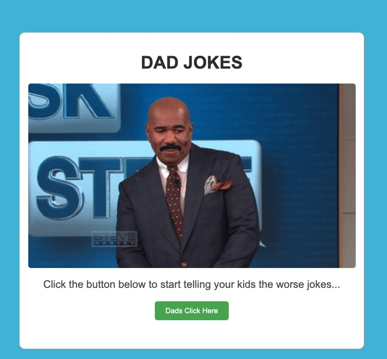

# Dad Joke Teller




## Description
Dad Joke Teller is a fun and interactive web application that shares hilarious dad jokes. It's designed to lighten up the mood and is perfect for sharing a laugh with friends and family. The application features a custom-built API, developed specifically for this project, to serve a variety of dad jokes at the click of a button. Each joke is accompanied by laughter audio for an added touch of humor.

## About the API: 
I developed the Dad Jokes API specifically for this application. It's designed to deliver a wide range of dad jokes, ensuring a fresh and humorous experience every time.

## Features
- Custom-built API to fetch and display a variety of dad jokes.
- Interactive button to request new jokes.
- Laughter audio playback with each joke for an enhanced experience.
- Responsive design for a great experience on various devices.

## Technologies Used
- HTML
- CSS
- JavaScript
- Custom API

## Installation
To experience Dad Joke Teller locally, follow these steps:

1. Clone the repository:
   ```bash
   git clone https://github.com/brucesailes/dad-jokes.git

2. Navigate to the project directory:
   ```bash
   cd dad-joke

3. Open `index.html` in your web browser.

## Contribution 

Contributions to the Dad Joke Teller are always welcome!

Feel free to open an issue or submit a pull request if you have suggestions for improvements.

